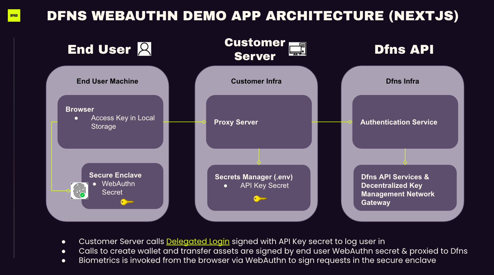

# Welcome to the Dfns WebAuthn Demo App

Dfns aims to create the most secure and programmatic wallet-as-a-service platform in web3. We want to make it easy for all developers, blockchain-savvy or not, to build Web3 products with great user experiences, and onboard the next billion users swiftly, without compromising on security.

The question is how can we create a balance between usability and security, enabling millions of developers to create blockchain-based apps for billions of users? The solution is combining a seamless UX with a decentralized key management network, removing the notion of seed phrases entirely from onboarding.

To streamline the user experience, we leverage [WebAuthn](webauthn.guide) to access secrets stored in the secure enclave of the user's device which sign challenges to provide access to our API. This demo application showcases one of the simplest flows possible using this stack. It's built on Next.js in React. Here's a diagram of the architecture:

 

